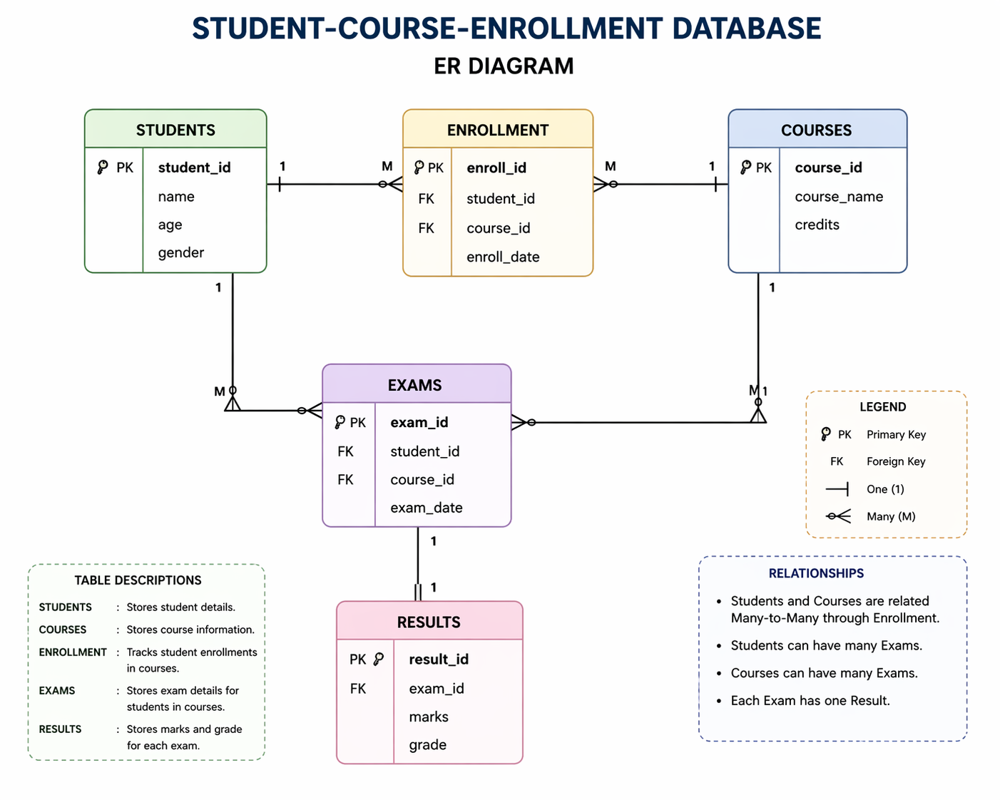

# Student-Course-Enrollment-Project
A database mini project built using MySQL to handle student records, course management, enrollment tracking, exams, and results. Showcases SQL concepts like table relationships, joins, and aggregate functions.

##  Project Description
This project is a MySQL-based database system designed to manage students, courses, enrollments, exams, and results. It demonstrates how relational databases are used to store and organize academic data efficiently.

##  Objectives
- To design a relational database system
- To implement relationships using primary and foreign keys
- To perform data retrieval using SQL queries
- To analyze student performance and course data

##  Database Tables
- **Students** – Stores student details (name, age, gender)
- **Courses** – Stores course information (course name, credits)
- **Enrollment** – Links students and courses (many-to-many relationship)
- **Exams** – Stores exam details for students
- **Results** – Stores marks and grades

##  Relationships
- One student can enroll in many courses
- One course can have many students
- Each exam belongs to one student and one course
- Each exam has one result

##  Technologies Used
- MySQL
- SQL

##  Files Included
- `schema.sql` – Database structure
- `data.sql` – Sample data
- `queries.sql` – SQL queries for analysis
- `er_diagram.png` – ER diagram representing entities and relationships

##  Sample Queries
- List all students
- Students enrolled in a specific course
- Count students per course
- Highest scoring student
- Average marks per course

##  Learning Outcomes
- Understanding of database design
- Writing SQL queries using joins and functions
- Working with real-world data scenarios

##  Conclusion
This project helps in understanding how database systems work in real-life applications such as student management systems used in educational institutions.
## ER Diagram

